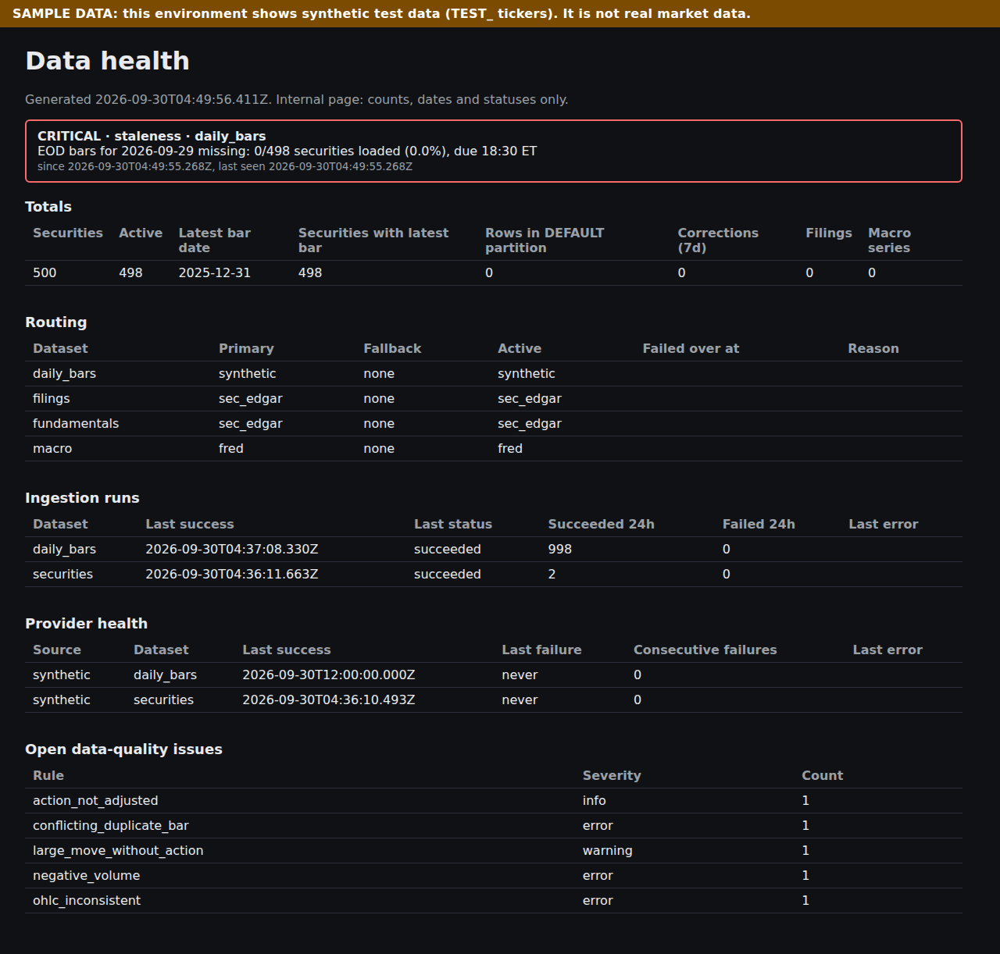

# Phase 0 Report: Foundations and Data Layer

**Dates:** plan approved and implemented 2026-09-30.
**Branch:** `claude/dazzling-edison-hoszan`.
**Commits:** 13, Conventional Commits.
**Result:** 4 of 5 acceptance criteria met. The live EDGAR run waits on a brand name and contact email.



## Acceptance criteria

| Criterion                                                            | Result                                          | Evidence                                                                                                                                                                                                                                                                                     |
| -------------------------------------------------------------------- | ----------------------------------------------- | -------------------------------------------------------------------------------------------------------------------------------------------------------------------------------------------------------------------------------------------------------------------------------------------- |
| 10 years of daily bars for a 500-ticker universe ingest idempotently | **Met**                                         | `apps/worker/test/backfill.acceptance.test.ts` (CI step "Phase 0 acceptance"). 1,251,786 bars; the second pass inserts 0 and updates 0, with 0 duplicate keys and 0 rows in DEFAULT. Also run through the CLI: 83s first pass, 58s second pass                                               |
| Split fixtures produce correct adjusted series                       | **Met**                                         | 4:1, 20:1 and 1:10 reverse splits: adjusted price = raw × factor and adjusted volume = raw ÷ factor before the ex-date; the move across the ex-date is < 20% while raw moves by the ratio (acceptance test, `adjustments.test.ts`, `ingest.int.test.ts`)                                     |
| EDGAR companyfacts for 50 companies without a single 403/429         | **Pending: needs brand name and contact email** | Adapter, limiter and CLI are ready (`pnpm worker edgar --tickers …`, RUNBOOK "EDGAR live run"). The limiter is proven at ≤ 8 grants per 1s window across 3 clients against real Redis. `sec.gov` is reachable from this environment                                                          |
| Staleness alerts fire in a simulated outage                          | **Met**                                         | `apps/worker/test/monitor.int.test.ts`: primary down at 18:31 ET → critical staleness alert → failover → fallback backfills the session → alert resolves → 3 healthy probes → failback. Also the failure-threshold path, the no-fallback path, and a regression test for the failback streak |
| CI is green                                                          | **Met**                                         | Every push on this branch passed (checks, Postgres 17/Redis 7 integration with round trip, codegen drift, integration and acceptance, security scan)                                                                                                                                         |

## Demo script

```sh
# 1. Services and schema
docker compose up -d && pnpm install && cp .env.example .env
pnpm db:shim && pnpm db:migrate

# 2. Ten years x 500 synthetic tickers, twice (second run: inserted 0)
pnpm worker backfill --from 2016-01-04 --to 2025-12-31 --source synthetic
pnpm worker backfill --from 2016-01-04 --to 2025-12-31 --source synthetic

# 3. Split adjustment, raw vs adjusted, across TEST_SPLIT20's 20:1 ex-date
psql "$DATABASE_URL" -c "select p.date, p.close raw, a.close adjusted, a.split_factor
  from market.prices_daily p join market.prices_daily_adjusted a using (security_id, date, source)
  join market.securities s using (security_id)
  where s.ticker='TEST_SPLIT20' and p.date between '2022-07-14' and '2022-07-19' order by 1"

# 4. Freshness: the data ends 2025-12-31, so the monitor raises a critical staleness alert
pnpm worker monitor

# 5. Data-health page (Basic auth from .env): alert banner, SAMPLE DATA banner, runs, issues
pnpm --filter @market/web dev   # open http://localhost:3000/admin/data-health

# 6. The simulated outage, end to end
TEST_DATABASE_URL=... TEST_REDIS_URL=... pnpm --filter @market/worker exec vitest run --config vitest.int.config.ts test/monitor.int.test.ts
```

## Test results

| Suite                          | Tests        | Covers                                                                                                                                                                                                                       |
| ------------------------------ | ------------ | ---------------------------------------------------------------------------------------------------------------------------------------------------------------------------------------------------------------------------- |
| Unit                           | **160**      | config 14, calendar 30, db 4, market-data 85, compliance 3, worker 10, web 14                                                                                                                                                |
| Integration (Postgres + Redis) | **39**       | db 19 (constraints, partitions, RLS/privilege audit), market-data 2 (rate limiter, fail closed), worker 16 (ingest, idempotency, corrections, outage/failover, BullMQ dedupe/DLQ), web 2 (health data never contains prices) |
| Acceptance                     | **2**        | 500 × 10y idempotency; split adjustment                                                                                                                                                                                      |
| Migration round trip           | 6 migrations | rolling back k and re-applying restores an identical fingerprint, for every k                                                                                                                                                |

Local runs used Postgres 16 (sandbox) and Redis 7; CI runs Postgres 17 and Redis 7. Both are green.

## Bugs found and fixed during the phase

1. `HttpClient` let `undefined` options overwrite its defaults. The SEC client would have run with no retries and no `fetch`. Regression test added.
2. PUBLIC could execute the partition function: per-schema default privileges cannot revoke the global default. The security audit caught it; the function now revokes it explicitly.
3. Failover and failback in the same monitor tick, from a pre-outage success streak. Found by running against the 500-ticker database (ADR-011). The regression test fails without the fix.
4. Rejected-row counts undercounted conflicting duplicates (4 bars counted as 3).
5. Tiingo and EDGAR fixture values resembled real company data. Replaced with obviously synthetic values.

## How implementation departed from the plan

- **Rate limiter:** the plan's "token bucket" became a sliding-window log. A bucket can allow 2× the rate across a window edge (ADR-006).
- **New table `ops.dataset_routing`,** plus a `provider_health.consecutive_successes` column, to persist routing and failback state across processes. Migration 6 was edited in place; it has never been deployed.
- **Staleness failover** only reroutes when a fallback exists, and failback counts from the failover (ADR-011).
- **Job ids use `/`** instead of `:` (BullMQ constraint, ADR-010).
- **Extra queues and jobs:** `ingest-macro`, `maintenance`, `monitor`, `dead-letter`, `schedule-edgar`. Extra worker modules: `runtime.ts`, `dispatch.ts`, `http-stats.ts`, `freshness.ts`.
- **Calendar files** are `dates.ts`, `timezone.ts`, `holidays.ts` (holidays, early closes and special closures together) and `sessions.ts`, instead of four holiday files.
- **`@market/db` entry points split** (client/types; `/migrations`; `/security`; `/testing`), because Turbopack cannot bundle the runner's directory URLs.
- **EDGAR fixtures are hand-built,** not recorded. Recording needs the real User-Agent contact.
- **Tiingo `getSecurities`** requires configured asset classes rather than guessing.
- **Acceptance test** gets its own Vitest config and CI step. `pnpm build` (Next production build) added to CI.
- **License check** approves libvips (LGPL, via sharp) as ADR-009.

## Known issues

1. **EDGAR live acceptance run not done.** It needs `APP_NAME` and a real `SEC_CONTACT_EMAIL`.
2. **Tiingo adapter shape and `Authorization: Token` header unverified.** Verify with one personal-key request per endpoint; never commit the response.
3. **EDGAR `acceptanceDateTime` read as Eastern time** (conservative assumption, ADR-012); verify on the live run.
4. **Spin-off and merger price adjustments** are not applied; they are recorded as `action_not_adjusted` issues.
5. **EDGAR** reads only recent filings (`filings.recent`). Older pages and the bulk `submissions.zip`/`companyfacts.zip` path are Phase 1.
6. **FRED pagination** is not implemented. The adapter refuses a truncated response rather than silently dropping data (series of up to 100,000 observations are fine).
7. **Least-privilege database roles:** web and worker connect as the database owner locally. Create separate roles when deploying (Phase 1).
8. **No CSP yet** (nonce-based CSP is Phase 1). Security headers and noindex are in place.
9. **Admin auth is HTTP Basic** until Supabase Auth with an admin role and TOTP (Phase 1).
10. **The migration history table** mirrors the Supabase CLI's; confirm with `supabase migration list` on the first real project.
11. **Observability** is structured logs plus `ops` tables. Sentry and OpenTelemetry are Phase 1.
12. **Repository housekeeping:**
    - This branch became the repository's default branch, because it was the first branch pushed.
    - Dependabot opened four PRs against it (checkout v7, setup-node v7, pnpm/action-setup v6, gitleaks-action v3). Those versions are already in `ci.yml`, so the PRs can be closed.
    - You may want a `main` branch.

## Cost snapshot

- **Spent: $0.** Work ran in the development sandbox and on GitHub Actions. Each push uses about 5 runner-minutes: checks ~1.5, integration with acceptance ~3, security ~0.7. GitHub Free includes 2,000 minutes/month for private repositories; public repositories are free.
- **No vendor accounts** were created, and nothing was provisioned on Supabase, Render or Vercel.
- **Projected from Phase 1** (brief Part E, list prices; re-verify):
  - data display license: $250–$700/month;
  - infrastructure (Supabase Pro plus compute, Vercel Pro, Render worker and Key Value, Resend, Sentry): about $100–$300/month;
  - LLM: $0 until Phase 2.

## Phase 1 plan (draft for approval)

A full plan in the §0.1 format (each step verifiable in under 30 minutes) follows once these decisions are made.

**Goal:** a public launch candidate, per Part C Phase 1:

- auth; ticker pages with charts and indicators; fundamentals viewer; screener with saved screens;
- watchlists with SSE; earnings and economic calendars; sector heatmap; price and earnings alerts by email;
- basic portfolio tracker; compliance components and legal pages; cookie consent;
- SEO ticker and sector pages; Stripe Free/Pro with entitlements.

**Blocking questions:**

1. **Display license.** The Phase 1 acceptance requires licensed display verified before the domain goes public. Until a contract is signed, Phase 1 is built and demoed on synthetic data behind auth on preview deployments only. Has outreach to Tiingo, Twelve Data or Massive started?
2. **Brand and domain.** Needed for SEO, email (SPF/DKIM/DMARC), the SEC User-Agent and legal pages.
3. **Infrastructure provisioning.** I would create:
   - a Supabase project (Postgres 17);
   - a Vercel project (Pro, since Hobby is non-commercial);
   - a Render worker plus Render Key Value (Redis);
   - a Resend domain;
   - a Stripe account in test mode.

   Your Supabase, Vercel, Render and Resend accounts are connected, but these cost money and I'll only create them with your go-ahead.

4. **Earnings data source.** Estimates and actuals need a vendor that licenses them for display; Tiingo's EOD plan does not include them. Candidates: Twelve Data Business, or a separate earnings feed. The economic calendar can use FRED release dates (free).
5. **Sector classification.** GICS is licensed by MSCI and S&P and cannot be used without a license. Proposal: SIC codes from EDGAR submissions (public), or the price vendor's sector field if its display license covers it.
6. **Free and Pro prices and limits.** Part E suggests Pro at $15–20/month; the limits table is in the brief.

**Proposed build order** (each group becomes several verifiable steps):

| #   | Group                                                                                                                                                                        |
| --- | ---------------------------------------------------------------------------------------------------------------------------------------------------------------------------- |
| 1   | Infrastructure and deploy pipeline: preview/staging on real Supabase and Render, least-privilege database roles, Sentry                                                      |
| 2   | Supabase Auth: magic link plus Google/Apple, TOTP for admins, session list, admin role; move the data-health page behind it                                                  |
| 3   | User schema with per-user RLS policy tests (users, profiles, subscriptions, entitlements, watchlists, portfolios, transactions, saved_screens, alerts, audit_logs)           |
| 4   | Compliance components (§12 footer, delay labels, source/as-of tooltips, attribution registry rendering), legal pages, cookie consent                                         |
| 5   | `packages/indicators` with TA-Lib reference fixtures (1e-6)                                                                                                                  |
| 6   | Ticker pages (ISR) with Lightweight Charts (attribution), adjusted/unadjusted toggle, action markers; delisted and 404 states                                                |
| 7   | Fundamentals: `financial_statements` from XBRL, as-reported view, filing links, 10-company to-the-dollar check                                                               |
| 8   | Screener: `screener_snapshot` table, filter JSON, SQL-oracle tests, saved screens, p95 < 1s at 6,000 securities                                                              |
| 9   | Watchlists with SSE (Redis pub/sub fan-out, 1 update/s per symbol, delay enforced server-side)                                                                               |
| 10  | Calendars (earnings per question 4, FRED releases, dividends, splits) with ICS export; sector heatmap                                                                        |
| 11  | Alerts: price and earnings, evaluated in the worker, email via Resend with unsubscribe and CAN-SPAM address, at most once per crossing                                       |
| 12  | Portfolio tracker: manual and CSV entry, TWR/XIRR, allocation, benchmark; spreadsheet fixture (0.01%)                                                                        |
| 13  | Stripe Checkout, Customer Portal and webhooks (idempotent, queued); `can()`/`limit()` entitlements                                                                           |
| 14  | SEO: sitemaps by page family, structured data, canonical URLs, noindex for thin pages; Lighthouse CI, axe and Playwright E2E (signup → watchlist → alert → upgrade → cancel) |
