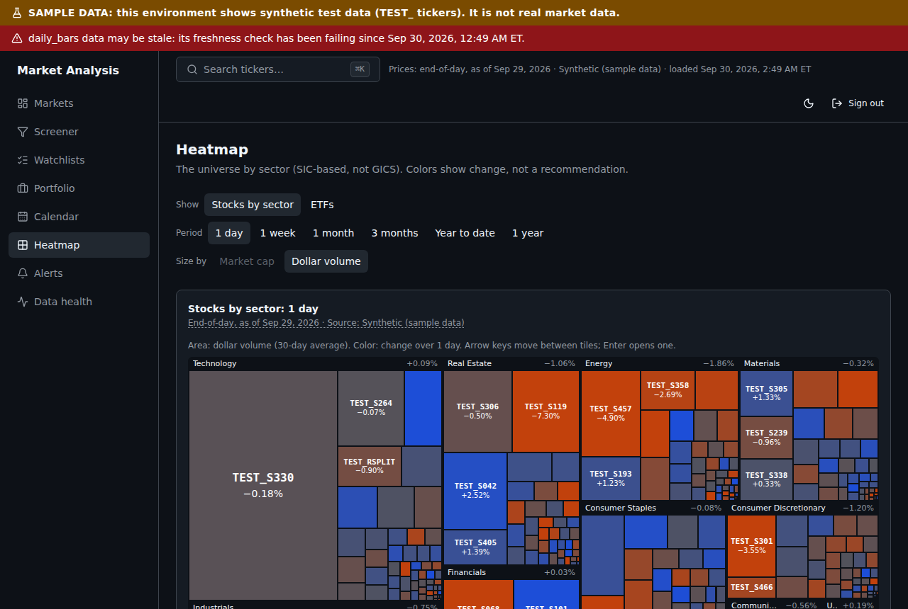

# Phase 1 Report: Personal Analytics App

**Dates:** plan approved and implemented 2026-09-30.
**Branch:** `claude/dazzling-edison-hoszan`.
**Commits:** 12 for Phase 1 (the plan, groups A–J, and this report with group K), Conventional Commits.
**Result:** all 8 acceptance criteria met on synthetic data and live SEC data. Four live checks wait for keys only the owner can get: Tiingo (real prices), Finnhub (earnings calendar), FRED (economic calendar) and Resend (real email delivery). None blocks using the app.



## Acceptance criteria

| Criterion                                                            | Result  | Evidence                                                                                                                                                                                                                                                                                                                                    |
| -------------------------------------------------------------------- | ------- | ------------------------------------------------------------------------------------------------------------------------------------------------------------------------------------------------------------------------------------------------------------------------------------------------------------------------------------------- |
| Journey: log in → watchlist → alert fires → email captured → returns | **Met** | `e2e/journey.spec.ts`: signs in, builds a watchlist, opens the ticker from it, creates an alert from the ticker page, runs the real `pnpm worker alerts` against a local stand-in for Resend's API, checks the captured email and the "Emailed" event, imports a portfolio CSV and sees holdings, TWR and XIRR. axe on every page it visits |
| Every price shows its source, as-of time and delay label             | **Met** | `DataLabel` (delay label and source visible, fetch time and attribution in a tooltip) on every price block: Markets, ticker header and chart, watchlists, screener, heatmap, calendar, portfolio holdings and performance. Checked in E2E `shell`, `chart`, `screener`, `watchlists`, `heatmap`. Alert emails carry as-of date and source   |
| Indicator reference tests pass (within 1e-6)                         | **Met** | 17 indicators against TA-Lib 0.8.1 output (and NumPy/pandas for the five TA-Lib lacks); worst difference about 4e-12 (ADR-019)                                                                                                                                                                                                              |
| axe finds zero critical issues                                       | **Met** | Every E2E spec runs axe (WCAG 2.2 AA tags) and fails on any serious or critical violation: 0 across all pages, including the new calendar, heatmap, alerts and portfolio pages                                                                                                                                                              |
| Ticker page LCP under 2.5 s                                          | **Met** | `e2e/lighthouse.spec.ts` runs Lighthouse 13.5 (default mobile profile: simulated slow 4G, 4× CPU slowdown) on a signed-in ticker page: **LCP 0.91 s**, FCP 0.77 s, CLS 0.0005, performance score 0.79                                                                                                                                       |
| Screener p95 under 1 s at 6,000 securities; results equal the oracle | **Met** | p95 10.9 ms over 47 screens at 6,000 synthetic securities; SQL results equal an independent in-memory oracle on 300 random screens and every preset (ADR-021)                                                                                                                                                                               |
| Portfolio metrics match the spreadsheet fixture within 0.01%         | **Met** | `packages/portfolio`: every day's cash, value, flow and TWR index, plus TWR, XIRR, drawdown, realized and unrealized gains, dividends and fees, match `scripts/make_fixture.py` (an independent row-by-row calculation, `expected.csv`) within 0.01%. XIRR matches the spreadsheet function's documented example to 1e-8 (ADR-023)          |
| No route serves data without the owner's session                     | **Met** | E2E `shell`: every page (10) redirects to login, every API (4) returns 401, and a server-action POST is refused. `test/routes.test.ts` fails if a route is added without joining that list. The proxy fails closed (503) when login is not configured (ADR-018)                                                                             |

Also verified live against SEC (E4, 2026-09-30): 10 companies' latest 10-Ks, 301 statement values equal to SEC's own rendering to the dollar, 0 mismatches, 40 requests all HTTP 200.

## Demo script

```sh
# 1. Services, schema, synthetic data, snapshot
docker compose up -d && pnpm install && cp .env.example .env
pnpm web:hash-password                 # paste the two lines into .env
pnpm db:shim && pnpm db:migrate
pnpm worker backfill --from 2016-01-04 --to 2025-12-31 --source synthetic
pnpm worker screener

# 2. The app (sign in with your password)
pnpm web                               # http://127.0.0.1:3000
#    Markets → ⌘K "TEST_SPLIT4" → Chart (press ] and [, add RSI and MACD) → Financials needs EDGAR data
#    Screener → preset "Within 2% of the 52-week high" → save it
#    Watchlists → create, add TEST_DIV, TEST_SPLIT4; the worker's bars_updated events update rows live
#    Heatmap → arrow keys move between tiles, Enter opens one
#    Calendar → Dividends and splits → Download .ics
#    Alerts → "Closes above" on TEST_SPLIT4, then: pnpm worker alerts
#    Portfolio → create, import the template CSV (Import CSV → Template)

# 3. Real SEC data for ten companies, and the statement check against SEC's rendering
EDGAR_ENABLED=true APP_NAME="Market Analysis" SEC_CONTACT_EMAIL=<your address> \
  pnpm worker edgar --tickers AAPL,MSFT,NVDA,JPM,CVX,WMT,JNJ,KO,PG,HD
EDGAR_ENABLED=true APP_NAME="Market Analysis" SEC_CONTACT_EMAIL=<your address> \
  pnpm worker check-statements

# 4. The acceptance suite
pnpm --filter @market/web build && pnpm --filter @market/web test:e2e
```

## Test results

| Suite                          | Tests         | Covers                                                                                                                                                                                                                               |
| ------------------------------ | ------------- | ------------------------------------------------------------------------------------------------------------------------------------------------------------------------------------------------------------------------------------ |
| Unit                           | **400**       | market-data 130 (adapters, recorded SEC pages, statements), indicators 93, web 46, calendar 30, screener 19, worker 19, portfolio 17, config 15, alerts 14, compliance 7, ui 6, db 4                                                 |
| Integration (Postgres + Redis) | **82**        | worker 36 (ingest, EDGAR, screener snapshot, calendars, alerts with a Resend stand-in, outage/failover, queues), db 23 (RLS, privileges, per-user tables), web 13, market-data 6, screener 4 (6,000-security performance and oracle) |
| End to end (Playwright)        | **24**        | journey, owner access, charts, financials, screener, watchlists with live updates, calendar and .ics, heatmap keyboard navigation, alerts with a real worker run, portfolio imports, Lighthouse; axe on every page                   |
| Acceptance                     | **2**         | Phase 0: 500 × 10 years idempotent ingest; split adjustment                                                                                                                                                                          |
| Migration round trip           | 11 migrations | rolling back k and re-applying restores an identical fingerprint, for every k                                                                                                                                                        |

Local runs used Postgres 16 and Redis 7; CI runs Postgres 17 and Redis 7. CI was green for every group through J; this final commit (K) was green locally and is checked on push.

## Measurements

| What                             | Result                                                                                          |
| -------------------------------- | ----------------------------------------------------------------------------------------------- |
| Chart, full history (2,598 bars) | renders within the 300 ms budget (E2E)                                                          |
| Indicators vs TA-Lib             | worst difference about 4e-12                                                                    |
| Screener                         | p95 10.9 ms at 6,000 securities                                                                 |
| Heatmap, 479 tiles               | page ready (DOMContentLoaded) in about 340 ms warm, 600 ms cold; re-layout on resize 100–150 ms |
| Ticker page, Lighthouse mobile   | LCP 0.91 s, FCP 0.77 s, CLS 0.0005, total blocking time 0.9 s, score 0.79                       |
| Statements vs SEC rendering      | 301 values, 0 mismatches (10 companies)                                                         |

## Bugs found and fixed during the phase

1. Next's env loader cached its first load (the app's own directory), so the repository's root `.env` never reached the web app and it answered 503. Replaced with `process.loadEnvFile` in `next.config.ts`.
2. A stale `next-server` kept the E2E port; the usual `pkill` patterns also matched the shell running them. Stop scripts now match the server's own process title.
3. Companyfacts `fy`/`fp` describe the filing, not the period: a 10-K's prior-year comparatives carry the new fiscal year. Periods are now keyed by each filing's own dates (ADR-020).
4. Revenue and net income were blank for some filers until more concepts were mapped (for example `RevenueFromContractWithCustomerIncludingAssessedTax`).
5. axe caught horizontally scrollable tables that keyboards could not reach; every such region is now focusable and labelled.
6. The CLI failed with "Finnhub needs Redis" when only `FINNHUB_API_KEY` was set; it now creates the shared limiter for Finnhub too.
7. Alert levels were shown rounded to cents, so a level of $2.705 read as $2.71 and a test could not find a level between two one-cent-apart closes. Prices in alerts keep up to four decimals.
8. The portfolio chart's axis labels were clipped for large returns ("8,311.1%" showed as "311.1%"), and 0% overlapped the bottom label. The left margin now fits the longest label and crowded ticks are skipped.
9. Heatmap tickers were cut off on narrow tiles ("EST_S3"); labels now show only where they fit whole.

## How implementation departed from the plan

- **Migration order:** 10 became the per-user tables (saved screens needed them in group F) and 11 the calendars (ADR-021).
- **Heatmap sizing:** by market cap as planned, but synthetic securities have no SEC shares outstanding, so the map falls back to 30-day dollar volume when no security has a market cap, and says so. With real data it sizes by market cap and counts the securities left out.
- **Alert evaluation** looks at the latest bar only; a day the worker misses is not re-evaluated (ADR-022). Earnings-upcoming alerts need the Finnhub key.
- **Portfolio chart** is a static SVG rather than Lightweight Charts: two lines, no interaction needed, no extra script.
- **Dashboard** gained "Your watchlists" and "Recent alerts" panels in group K; the index-ETF panel appears once SPY, QQQ, DIA or IWM have prices (not in the synthetic set).
- **Group L** (private cloud deploy) was not chosen and was skipped.

## Known issues

1. **Waiting for owner keys:** Tiingo (A4 live shape check, A6 live bootstrap), Finnhub (the adapter follows the documentation and is marked SHAPE UNVERIFIED), FRED (economic calendar), Resend (delivery tested against a stand-in server only). Each has a runbook entry.
2. **Ticker page total blocking time** is about 0.9 s in Lighthouse's mobile profile (chart and indicator code on a 4× slower CPU). LCP is well within budget; splitting the chart bundle further would lower it.
3. **Dependabot's own updater** fails to compute updates for `@types/node` and `typescript` in this pnpm workspace ("unknown_error"). This is the Dependabot job, not the project's CI; updates for those two need doing by hand.
4. **E2E tests share the local database** with development. Each test removes what it creates, but a failed run can leave rows (named `E2E …` or `Journey …`).
5. Calendar times are shown as dates with "before the open / after the close", not converted to the viewer's time zone (all events are US market dates).
6. Watchlists have no custom columns, notes or CSV import/export yet (plan G1 listed notes and CSV; deferred as low value for one user).

## Cost snapshot

| Item                | Cost                                                             |
| ------------------- | ---------------------------------------------------------------- |
| Hosting             | $0 (runs locally: Docker Compose Postgres and Redis)             |
| Tiingo personal     | $0 (free tier; Power about $30/month only if full-market wanted) |
| SEC EDGAR, FRED     | $0                                                               |
| Finnhub personal    | $0 (free tier)                                                   |
| Resend              | $0 (free tier; alerts go only to the owner)                      |
| CI (GitHub Actions) | within the free allowance for this repository                    |

## Phase 2 plan

Drafted for approval: [`PHASE_2_PLAN.md`](PHASE_2_PLAN.md). Nothing from it has been started.
