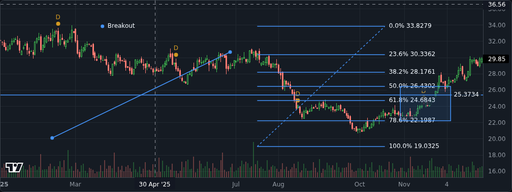

# Phase 2a Report: Backtests, Risk, Valuation, Alerts, Drawings and Dashboard

**Dates:** plan approved and 2a implemented 2026-10-02.
**Branch:** `claude/dazzling-edison-hoszan`.
**Commits:** 15 for Phase 2a: groups A–F in 13 commits (`c9e8a12` to `2002684`), then two for group G (the `portfolio_risk` flag, and this report). All use Conventional Commits, and CI was green on each of the first 13.
**Result:** every 2a acceptance criterion is met on synthetic data. The other two Phase 2 criteria (the AI eval, and push on desktop and phone) belong to 2b. The acceptance check found one gap: portfolio risk had shipped without a feature flag. It now has one (`portfolio_risk`), with an E2E test.



## Acceptance criteria (2a)

| Criterion                                                                     | Result  | Evidence                                                                                                                                                                                                                                                                                                                                                                                                                                                                                                                                                                  |
| ----------------------------------------------------------------------------- | ------- | ------------------------------------------------------------------------------------------------------------------------------------------------------------------------------------------------------------------------------------------------------------------------------------------------------------------------------------------------------------------------------------------------------------------------------------------------------------------------------------------------------------------------------------------------------------------------- |
| Backtest golden, look-ahead canary and survivorship tests pass; re-runs match | **Met** | Golden: buy-and-hold matches an independent Python model with dividends reinvested, with dividends as cash, and with costs and whole shares (`packages/backtest/test/golden.test.ts`). Canary: a rule that reads a future bar is rejected, and a run cut off at any date trades the same with or without later data. Survivorship: a delisted stock is in historical universes until the day before it delisted and closes at its last close (unit and worker integration). Re-runs: same report and same SHA-256 data fingerprint (integration; the E2E re-run shows it) |
| Portfolio metrics, now with risk, match the spreadsheet fixture within 0.01%  | **Met** | `packages/portfolio/test/risk.test.ts` against `scripts/make_fixture.py`, an independent row-by-row calculation with relative tolerance 1e-4. Checks: volatility, Sharpe, Sortino, longest drawdown, beta and correlation, holdings' correlations across a 2:1 split, concentration and daily P&L. A mutated standard-deviation formula fails the tests (ADR-026)                                                                                                                                                                                                         |
| DCF matches its spreadsheet fixture; input changes update outputs in 100 ms   | **Met** | `packages/valuation/test/dcf.test.ts` against `scripts/make_fixture.py`: three scenarios, every year's row, totals and the sensitivity grid, matched to 1e-10. A mid-year-discounting mutation fails 9 tests. In the browser (E2E), a recompute took **6.0 ms** in this run and 9.3 ms when group D shipped (ADR-027)                                                                                                                                                                                                                                                     |
| Alerts arrive within 60 s of their data, at most once per crossing            | **Met** | Through real BullMQ queues and Redis, the alert email went out **53–107 ms** after the end-of-day job was queued (three runs in this check; 108 ms when E2 shipped). Once per crossing: evaluator unit tests, a re-run on the same bar records a duplicate rather than a second event, and events are unique per alert and `event_key` in the table (ADR-028)                                                                                                                                                                                                             |
| axe finds zero critical issues; ticker page LCP under 2.5 s                   | **Met** | 16 of the 17 E2E specs run axe with WCAG 2.2 AA tags (32 checks; Lighthouse is the exception) and fail on any serious or critical violation: 0 found, including the backtest, valuation, notification, alert, settings and dashboard pages. Lighthouse 13.5 (mobile profile) on a signed-in ticker page: **LCP 0.87 s**, FCP 0.73 s, CLS 0, score 0.92                                                                                                                                                                                                                    |
| No route serves data without the owner's session                              | **Met** | E2E `shell`: all 17 pages redirect to login (10 at Phase 1) and all 5 APIs return 401 (4 at Phase 1). A server-action POST without a session is refused. Every server action in the new pages checks the owner first. `test/routes.test.ts` fails if a route is added without joining the list                                                                                                                                                                                                                                                                            |
| Every number shows its source and as-of date                                  | **Met** | Backtest reports: source and run end date, plus the data fingerprint. Valuation inputs: each names its period and filing date ("From filings: four quarters to …, filed …"). Risk measures: method and source in a tooltip, risk-free rate from FRED DTB3. Dashboard widgets: the same `DataLabel` as Phase 1. Notifications and alert emails: their data source, plus SAMPLE DATA on synthetic data                                                                                                                                                                      |
| Every Phase 2 feature ships behind a flag                                     | **Met** | 7 switches on `/settings`: Backtests, Portfolio risk, Valuation, More alert types, Notifications, Chart drawings, Customizable dashboard. Each has an E2E test that turns it off, checks the feature disappears (pages answer 404 or panels are gone), and restores it. `portfolio_risk` was added during this check                                                                                                                                                                                                                                                      |

## Demo script

```sh
# 1. As in Phase 1 (services, schema, synthetic data), then the long-running worker:
#    backtests, alert checks and email run there
docker compose up -d && pnpm install
pnpm db:migrate                        # 16 migrations
pnpm worker backfill --from 2016-01-04 --to 2025-12-31 --source synthetic   # if not loaded
pnpm worker screener
pnpm --filter @market/worker start     # leave running
pnpm web                               # http://127.0.0.1:3000, sign in

# 2. In the app
#    Backtests → New backtest → pick an example → Run backtest. The report opens with the
#      hypothetical-results disclosure and the assumptions panel; "Run again" shows the same
#      data fingerprint. Try a parameter sweep: the grid labels its best cell as picked with hindsight
#    Portfolio → import the template CSV → Risk panel (focus a measure's info button for its method)
#    Ticker page → Valuation tab (needs EDGAR statements: a ticker loaded with `pnpm worker edgar`,
#      or TEST_FIN after an E2E run seeds it) → edit WACC → save a scenario → Peers
#    Ticker page → Chart → drawing tools: Trend line (two clicks), Fibonacci retracement, Text;
#      reload: still there
#    Alerts → "RSI crosses below a level", "New SEC filing" or "Screen results change" → wait for
#      the next data load, or run: pnpm worker alerts → the bell counts it → Notifications → snooze
#      it for 1 day
#    Markets → Customize → move widgets with Up/Down (Enter keeps focus), hide one, drag one → Done
#    Settings → turn a feature off and back to its default

# 3. The acceptance suite
pnpm test && TEST_DATABASE_URL=… TEST_REDIS_URL=… pnpm test:int
pnpm --filter @market/web build && pnpm --filter @market/web test:e2e
```

## Test results

| Suite                          | Tests (Phase 1) | Covers                                                                                                                                                                                                                         |
| ------------------------------ | --------------- | ------------------------------------------------------------------------------------------------------------------------------------------------------------------------------------------------------------------------------ |
| Unit                           | **528** (400)   | market-data 130, indicators 93, web 65, backtest 46, alerts 37, calendar 30, portfolio 24, valuation 22, config 20, worker 19, screener 19, compliance 9, ui 6, metrics 4, db 4                                                |
| Integration (Postgres + Redis) | **112** (82)    | worker 60 (adds backtest runs in a worker thread, survivorship, reproducibility, and alerts through real queues with recorded SEC filings), db 28 (RLS and constraints for every new table), web 13, market-data 6, screener 5 |
| End to end (Playwright)        | **39** (24)     | adds settings, backtests 3, portfolio risk switch, valuation 3, notifications 3, drawings 2, dashboard 2; axe on every page visited                                                                                            |
| Acceptance                     | **2**           | Phase 0: 500 × 10 years idempotent ingest; split adjustment                                                                                                                                                                    |
| Migration round trip           | 16 migrations   | rolling back k and re-applying restores an identical fingerprint, for every k; generated types up to date                                                                                                                      |

This check ran locally (Postgres 16, Redis 7) on 2026-10-02: format, lint and typecheck clean; unit tests 45 of 45 turbo tasks passed; integration 5 of 5 suites; E2E 39 passed, 0 flaky, in 2.1 minutes against a database loaded the way CI loads it. CI runs Postgres 17 and Redis 7 and checks this commit on push.

## Measurements

| What                           | Result                                                                                       |
| ------------------------------ | -------------------------------------------------------------------------------------------- |
| Alert delivery (queue → email) | 53–108 ms over four runs; limit 60 s                                                         |
| DCF recompute in the browser   | 6.0 ms (9.3 ms at group D); limit 100 ms                                                     |
| Ticker page, Lighthouse mobile | LCP 0.87 s, FCP 0.73 s, CLS 0, total blocking time 0.34 s, score 0.92 (Phase 1: LCP 0.91 s)  |
| Screener at 6,000 securities   | p95 5.1 ms over 47 screens (Phase 1: 10.9 ms); still equals the oracle on 300 random screens |
| Backtest golden curves         | every session's equity within 1e-9 (relative) of the reference model                         |

## Bugs found and fixed during the phase

1. **Drawings lost their second click.** Lightweight Charts' click subscription holds back a second click within 500 ms while it waits for a possible double click, so a quick two-click trend line dropped its second point. Clicks now come from native pointer events, converted with the chart's coordinate functions. A press that moves more than 5 px counts as a pan.
2. **A drawing restarted halfway.** An effect copied stale React state over the pending first point, so the second click sometimes began a new drawing. The ref is now the only copy.
3. **The backtest E2E failed in CI only.** It asked for 2019–2022, and CI loads only 2025 (`71a262e`). It now uses the stored range.
4. **axe reported a missing page title.** On the alert page, the async metadata streamed the `<title>` in after the content. The page now has a static title, and the axe helper waits for a title after client-side navigations.
5. **Dragging a dashboard widget sometimes did nothing.** The drag-over handler read React state that had not yet re-rendered. A ref holds the dragged widget now.
6. **Ranking by Sharpe without T-bill rates failed obscurely.** It now gives a clear message, and the builder ranks by CAGR when no rates are stored.
7. **Portfolio risk had no feature flag** (found by this check). `portfolio_risk` added, with an E2E test.
8. **Test-only issues:**
   - The watchlist E2E sometimes reopened the menu before an add finished (1 run in 6). It now waits; a mutation run showed the component was right.
   - Local re-runs hit the default daily email cap; the E2E worker raises it.
   - Lighthouse sometimes reports NO_NAVSTART locally; it measures once more when that happens, and the limit is unchanged.

## How implementation departed from the plan

- **Alert evaluation** runs on its own `alerts-evaluate` queue. Ingest jobs queue it after they store bars, filings or a screener rebuild, rather than it listening to the `bars_updated` pub/sub message. A queued job survives a restart; a pub/sub message is lost when no one is listening (ADR-028).
- **`public.push_subscriptions`** moved from migration 15 to J2's migration, with the code that uses it.
- **Step C3** (broker CSV templates) was dropped: no brokers were named (decision 4).
- **The dashboard** is arranged with buttons first (move, resize, hide) plus native drag by a handle, on a one- or two-column grid. react-grid-layout and free placement were not used: no new dependency, and the keyboard path comes first (WCAG 2.5.7) (ADR-030).
- **Drawings belong to a price basis.** A drawing stays on the chart it was drawn on (raw or adjusted) instead of being converted, since a split would move it. The list says how many are on the other chart (ADR-029).
- **`insider_purchase` alerts** are reserved for H4, which brings the Form 4 data they need.
- **The notification bell** polls every 30 s while the tab is visible instead of using SSE. A count changes rarely; SSE stays for quotes. Push arrives in 2b.
- **Backtest results** are stored as JSONB in Postgres rather than object storage (about 0.6 MB for a 10-year, 300-stock report). Short selling and borrow costs are out of scope (ADR-025).
- **The `portfolio_risk` flag** was registered at acceptance, not when group C started as ADR-024 intends.

## Known issues

1. **Waiting for owner keys** (from Phase 1): Tiingo, Finnhub, FRED and Resend. Without FRED's DTB3, Sharpe and Sortino show as unavailable in backtests and portfolio risk (by design, never computed with zero).
2. **Drawings can't be moved or edited** once placed: delete and redraw, or use the form. They snap to daily sessions.
3. **Dragging a dashboard widget needs both widgets on screen**, because the page doesn't scroll while dragging. Dragging is meant for a mouse; the buttons work everywhere, including on phones.
4. **New-filing alerts for Schedules 13D and 13G** watch both the old (`SC 13D`) and new (`SCHEDULE 13D`) EDGAR form names. Which one EDGAR's index uses is to be confirmed against recorded data when real filings arrive.
5. **One unexplained unit-test failure:** a `@market/web` unit task failed once under full parallel load during group F, and its output was not kept. It did not reproduce in 8 re-runs, and the heatmap timing test passed 6 of 6 under CPU load. Watching for it.
6. **Lighthouse locally** sometimes reports NO_NAVSTART after the journey spec. The test measures again and the second measurement is valid; not seen in CI.
7. **Price and indicator crossings during a snooze are not replayed**, because the next check reads the latest bar. Filing and screen changes are kept. A screen with more than 5,000 results is compared on its first 5,000 by ticker.
8. **Carried over from Phase 1:** Dependabot's updater can't compute `@types/node` and `typescript` updates; E2E tests share the local database; watchlist notes and CSV import/export are deferred.

## Cost snapshot

| Item                              | Cost                                                                                                                                                                                         |
| --------------------------------- | -------------------------------------------------------------------------------------------------------------------------------------------------------------------------------------------- |
| Hosting, data (Tiingo, SEC, FRED) | $0 (unchanged: runs locally; free tiers)                                                                                                                                                     |
| Phase 2a features                 | $0: backtests, risk, valuation, alerts, drawings and the dashboard use only our own database                                                                                                 |
| CI (GitHub Actions)               | within the free allowance for this repository                                                                                                                                                |
| 2b, expected                      | AI model usage, capped by `AI_MONTHLY_BUDGET_USD` (default $10/month); Finnhub news on the free key; Tailscale personal plan (free; terms to verify before J3); browser push services (free) |

## Next: Phase 2b

As approved in [`PHASE_2_PLAN.md`](PHASE_2_PLAN.md), groups H–L:

- **H:** Form 4 insiders, 13F holders, FINRA short interest, the Ownership tab and insider-purchase alerts.
- **I:** news from Finnhub and SEC 8-K press releases, with versioned model-estimated sentiment.
- **J:** installable PWA, Web Push on desktop and phone, and private phone access over Tailscale.
- **K:** the AI assistant over our own data, with number verification, citations and evals.
- **L:** acceptance and the Phase 2 report.

What the owner will need to supply as 2b reaches each part (until then, everything runs on synthetic data and recorded SEC fixtures):

| For                   | What                                                                                                                              |
| --------------------- | --------------------------------------------------------------------------------------------------------------------------------- |
| K (AI)                | an Anthropic API key (K adds `ANTHROPIC_API_KEY` to `.env.example`); `AI_MONTHLY_BUDGET_USD` if not $10                           |
| I (news), earnings    | a free Finnhub key (`FINNHUB_API_KEY`)                                                                                            |
| J (push on the phone) | Tailscale installed and signed in on the computer running the app and on the phone; iPhone on iOS 16.4+, app added to Home Screen |
| Risk-free rate        | a free FRED key (`FRED_API_KEY`), for Sharpe and Sortino                                                                          |
| Email alerts          | a free Resend key and your address in `.env` (runbook "Email setup")                                                              |
